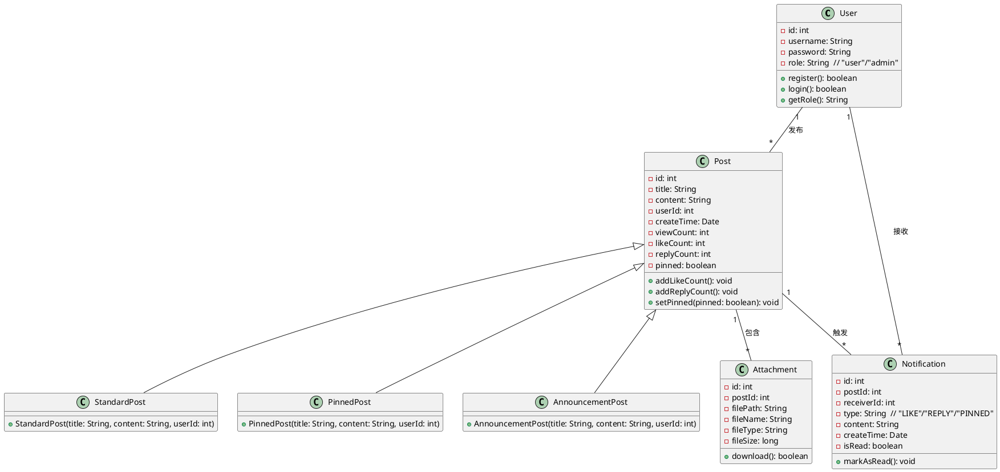
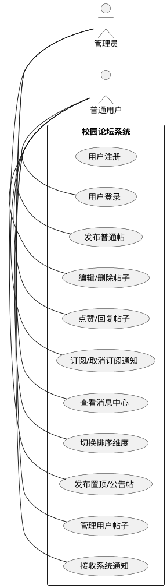
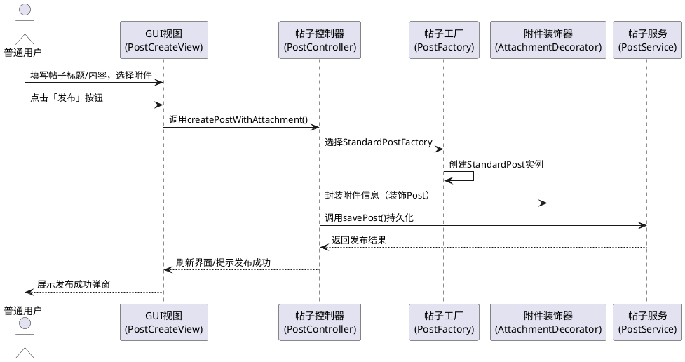

### 1.2 系统需求描述及分析
#### 1.2.1 功能需求描述
基于Java GUI的校园论坛系统面向校园师生群体，核心目标是构建轻量化、易操作的校园信息交流平台，系统需满足**用户管理、帖子管理、互动功能、排序展示、消息通知**五大核心功能需求，具体如下：
| 模块         | 核心需求                                                                 | 权限约束                     |
|--------------|--------------------------------------------------------------------------|------------------------------|
| 用户管理     | 注册/登录/个人信息查看；角色区分（普通用户/管理员）                       | 所有用户可注册/登录，管理员拥有特殊权限 |
| 帖子管理     | 发布/编辑/删除帖子；按类型（普通/置顶/公告）创建；添加/下载附件           | 普通用户仅可创建普通帖，管理员可创建置顶/公告帖 |
| 互动功能     | 帖子点赞/取消点赞；回复帖子；订阅/取消订阅帖子通知                       | 所有用户可点赞/回复，仅作者/订阅者接收通知 |
| 排序展示     | 按发布时间/浏览量/点赞数排序；置顶帖子优先展示；GUI实时刷新排序结果       | 所有用户可切换排序维度       |
| 消息通知     | 状态变更推送通知（点赞/回复/置顶）；消息中心存储通知；标记已读/未读       | 管理员接收系统级通知，普通用户接收个人通知 |

#### 1.2.2 静态结构分析（UML类图）
系统核心实体的静态关系通过类图体现，涵盖用户、帖子、附件、通知等核心类，以及类间的关联、继承、聚合关系：

**静态结构分析说明**：
1. 继承关系：`StandardPost`/`PinnedPost`/`AnnouncementPost`继承自`Post`，复用核心属性，仅扩展类型专属逻辑；
2. 关联关系：`User`与`Post`为“1对多”（一个用户发布多个帖子），`Post`与`Attachment`为“1对多”（一个帖子可包含多个附件）；
3. 依赖关系：`Post`状态变更触发`Notification`，`User`接收并管理`Notification`，体现“发布-订阅”的核心逻辑。

#### 1.2.3 动态流程分析
##### （1）核心用例图（参与者与功能交互）
展示系统参与者（普通用户、管理员）与核心功能的交互关系：

**用例分析说明**：
- 参与者划分：区分“普通用户”和“管理员”，体现权限分层设计；
- 功能覆盖：包含所有核心模块的关键操作，无遗漏核心需求；
- 权限边界：管理员专属用例（发布置顶/公告帖、管理用户帖子）与普通用户用例清晰分离。

##### （2）核心时序图（发布带附件的帖子流程）
以“普通用户发布带附件的帖子”为例，展示动态交互流程：

**时序流程分析说明**：
1. 分层交互：严格遵循MVC架构，View层仅负责交互，Controller层协调工厂/装饰器/服务层，Service层处理持久化；
2. 设计模式落地：工厂模式创建帖子实例，装饰器模式动态添加附件功能，体现“动态扩展、不修改原有逻辑”的设计原则；
3. 交互闭环：从用户操作到界面反馈形成完整闭环，符合GUI应用的交互逻辑。

#### 1.2.4 非功能需求分析
1. **易用性**：GUI界面遵循桌面应用交互习惯，按钮/表单布局清晰，操作步骤≤3步（如发布帖子仅需“填写内容→选择附件→发布”）；
2. **可扩展性**：基于设计模式（工厂/装饰器/观察者/策略）设计，新增功能（如投票帖、@用户）无需修改核心代码；
3. **性能**：帖子列表排序响应时间≤500ms，通知推送实时性≤1s；
4. **兼容性**：支持Windows/Linux系统，Java版本≥8，无需额外依赖。

#### 1.2.5 需求分析总结
系统需求覆盖“用户-帖子-互动-展示-通知”全流程，静态结构通过类图明确核心实体关系，动态流程通过用例图/时序图体现交互逻辑，权限分层、设计模式落地、非功能约束均为后续系统设计与实现奠定了清晰的需求基准，确保系统满足校园论坛的核心使用场景，同时具备良好的可扩展性和易用性。